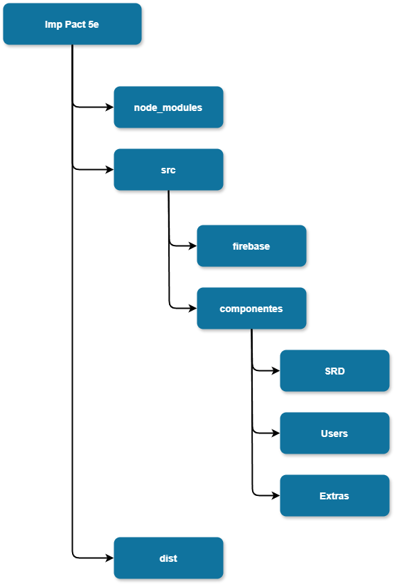

# Imp Pact 5e Backend

Este proyecto se centra en todos los documentos relacionados con la conexión al backend, las configuraciones pertinentes y la creación de la Wiki.

## Requisitos Mínimos

Para usar este proyecto, necesitas cumplir con los siguientes requisitos:

- **Node.js**: Versión 22.0.0 o superior.
- **Firebase**: Crear un proyecto en Firebase para usarlo como servidor.

## Carpetas Importantes

A continuación, se describen las carpetas más relevantes del proyecto:

- **node_modules**: Contiene todos los módulos necesarios para que el proyecto funcione. Estos son gestionados automáticamente mediante el comando de *Node.js* `npm`.
- **dist**: Contiene el proyecto listo para ser lanzado a producción. Esta carpeta se genera automáticamente usando el comando `npm run build`.
- **src**: Almacena todos los componentes del desarrollo del proyecto. Dentro de esta carpeta, hay dos subcarpetas principales:
    - **firebase**: Contiene toda la configuración relacionada con el servidor Firebase, así como las funciones principales del servidor. Además, incluye la configuración de rutas necesarias para la autenticación de usuarios.
    - **componentes**: Contiene tres subcarpetas importantes:
        - **SRD**: Almacena todos los componentes relacionados con la creación y mantenimiento de la información actualizada de la Wiki.
        - **Users**: Incluye los componentes relacionados con la creación de cuentas de usuario, inicio de sesión, cierre de sesión y la configuración de la persistencia de la sesión.
        - **Extras**: Contiene componentes utilizados de manera puntual en la aplicación web para mejorar la experiencia del usuario.

